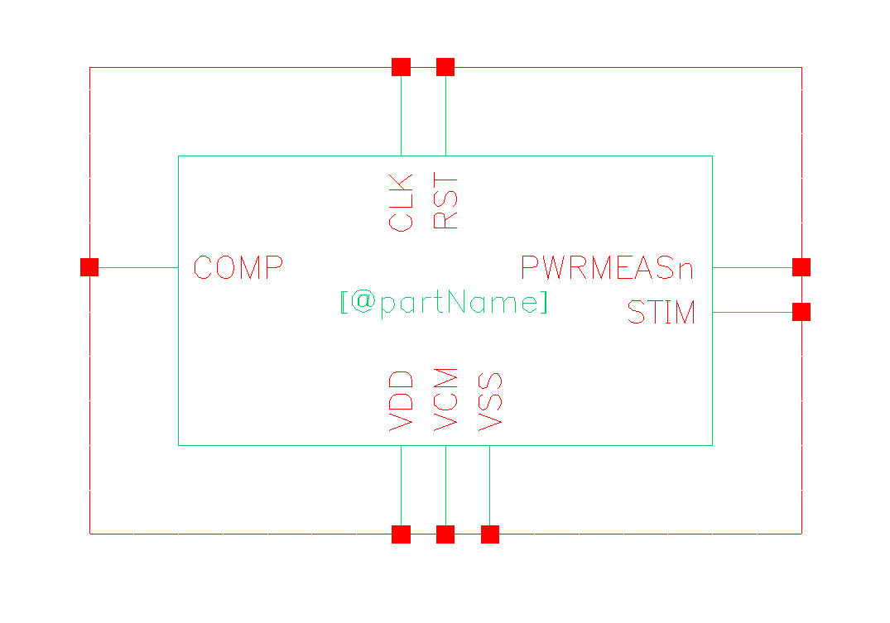
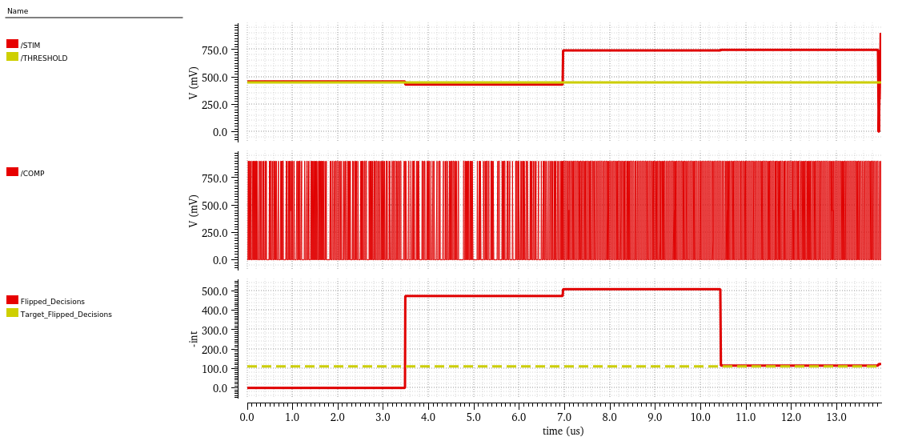

# Transient Simulation of Dynamic-Comparator Noise
This project includes a Verilog-A test block for measuring noise and offset of
a comparator.
Designed at the Institute of Microelectronics, Ulm University, Ulm, Germany
by Joschua Conrad under the supervision of Prof. Maurits Ortmanns.
Published at NEWCAS 2024.
When using the code or concepts shown here for your own work, please cite
the published paper as in [CITATION](CITATION.cff).
Also please acknowledge [LICENSE](LICENSE.md).





## Test Procedure
The test block can provide a test-voltage $v_{t}$ to the comparator,
simulate a number of decisions and read its output.
The following compaarator properties can be found:

- Plain comparator offset without any noise by utilizing a binary search (BS)
  algoithm. This needs only about 20 decisions and simulates very fast.
  
- Unknown noise and unknown offset by using the proposed confidence boosting
  and a mix of binary-search and deterministic convergence to find a 
  test-voltage $v_{t}$, which ensures a known share of decisions being
  flipped by noise. This simulation takes more time, but the confidence
  into the predicted sum of noise and offset is known without any assumptions
  or limitations regarding noise or offset.
  
- Unknown noise without any offset can be tested with the same algorithm, but
  deterministic convergence is then even faster, as it does not need to predict
  offset from simulation history.
  
- Lastly, the test block provides an input ramp with knwon bounds around the
  comparator's trip-point. This is handy for anaylzing e.g. metastability.
  
The following table lists the simulation procedure depending on whether the
comparator is noisy or has offset.
  
|    | w/ Offset | w/o Offset |
|----|-----------|------------|
|w/ Noise|Confidence-Boosted Convergence with offset guessed from simulation history|Confidence-Boosted Convergence with more educated guess $v_{o}=0$| 
w/o Noise|Rapid Binary-Search Convergence|Simulate input-ramp only|

## How to Use
It is assumed, that *Cadence Virtuoso Analog Design Environment* is used.

1. Download all files.

1. Create a new cell(view) from the code.

	1. Create empty Verilog-A cell and view
	
	1. Copy-paste the provided code from [veriloga.va](veriloga.va).
	
	1. Check and Save.
	
	1. Create a symbol view from Verilog-A view.
	
1. Place the block

	1. Place the schematic symbol next to the comparator in a schematic.
	
	1. Connect clock, reset and supply.
	
	1. *STIM* connects to the input of your comparator. *COMP* to the output
	   of the comparator. Use baluns, if the comparator has differential
	   terminals.
	   
	1. Parameterize the block. The CDF parameters should be editable on the
	   placed instance. See [parameter description](#parameters).
	   
	   - Make sure to set *SNCDFI_TABLE_PATH* to an absolute path.
	   
	   - Set *HAS_NOISE* and *HAS_OFFSET* to variables controlled from ADE.
	     This allows to first simulate just the offset without any noise and
	     then just the noise on the same testbench schematic.
	     
	   - *DECISIONS_PER_ITER* (K), *CONFIDENCE_SAMPLE_RANGE* (r) and
	     *EXPECTED_FLIP_NUMBER* (M) should always be set. Choose values from
	     the manuscript Table I.
	     
	   - *Threshold* and *Trf* should be set according to level and speed of
	     your logic signals. Good guesses are half the supply voltage for
	     *Threshold* and about 1/100 of the clock period for *Trf*.  
	   
1. Simulate
	
	1. Make sure, that the [sncdfi file](sncdfi_table.csv) is inside a
	   directory where the simulator finds it. This can be your project
	   directory. See also [sncdfi](#sncdfi).
	   
	1. Setup the simulation.
	
		1. Choose a simulator understanding Verilog-A, e.g. *Spectre*.
		
		1. Use a *TRAN* simulation. Possibly run two: a noisy and a non-noisy
		   one to find the sum of offset and noise and just the offset.
		   Make sure to run the exact same netlist (beside test block parameters)
		   to ensure that all devices use the same Monte-Carlo sequence in the
		   two (noisy, non-noisy) simulations.
		
		1. If automatic simulation stopping is enabled (default), choose a
		   huge simulation time. The test block will stop simulation as soon
		   as the $v_{t}$ search converged.
		   
		1. In the settings, go to *Outputs -> Save All* and enable *saveahdlvars*.
		
		1. Add Verilog-A variables as output. If the test-block instance is
		   named *ISTIM*, one can add the variable *finalvt* by adding the
		   output expression `getData("ISTIM:finalvt" ?result "tran")`. The results
		   browser can be used after a simulation to find these expressions.
		   Add the following outputs.
		   
		   | Variable | Meaning  |
		   | -------- | -------- |
		   | finalvt | The final test voltage $v_{t}$ after convergence, which is the noise amplitude standard deviation $\sigma_{n}$ minus the offset $v_{o}$. |
		   | convergencegood | 1, if the algorithm convergence worked. |
		   | flippeddecisionsdebug | How many decisions flipped during the last iteration. Over iterations, this approaches *M* and one can observe convergence here. |
		   | totaliters | Total number of done iterations, where each one simulated *K* samples. |
		   | badrampsamples | Refers to the input-ramp test. This many decisions did not have the desired value (due to noise, metastability, ...) |
		   
		   It is also recommended to create one output *endtime* with expression
		   `xmax(xval(anyoutput) -1)`, as that finds the end-time of the simulation.
		   *anyoutput* is any named output expression. With
		   `value(anyotheroutput endtime)`, one can then evaluate the values of
		   outputs at the end of simulation, as for e.g. *finalvt* that is the
		   one time where the variable has its final value.
		   
## Block Interface
This describes parameters and ports of the block.

### Parameters
First, common parameters are introduced.

| Parameter | Meaning | Allowed Values | Default |
|-----------|---------|----------------|---------|
|HAS_OFFSET|If set, it is assumed that the comparator has offset. So the offset is estimated by binary-search for non-noisy comparators. For noisy comparators, a confidence-boosted convergence for $v_{t}$ is always needed, but the offset $v_{o}$ does not need to be estimated from simulation history for comparators not having an offset.|bool|Comparator has offset.|
|HAS_NOISE|If set, it is assumed that the comparator has noise. The confidence-boosted convergence is used then. Otherwise, only a simple binary-search offset estimation or even just the ramp-shaped stimulus is applied.|bool|Comparator has noise.|
|DECISIONS_PER_ITER|Number of simulated decisions per iteration. Manuscript calls this *K*.|integer larger than 1|Defaults from Table I for $c=0.9$ and $a=0.1$.|
|EXPECTED_FLIP_NUMBER|Targeted number of noise-flipped decisions per iteration. Manuscript calls this *M*.|integer larger than 0|Defaults from Table I for $c=0.9$ and $a=0.1$.|
|CONFIDENCE_SAMPLE_RANGE|Tolerated range expressed in number of samples around *K*. Manuscript calls this *r*.|integer larger than or equal to 0|Defaults from Table I for $c=0.9$ and $a=0.1$.|
|DEBUG|Whether to print debug messages about convergence.|bool|Print messages.|
|FIRST_VT_FACTOR|Relative magnitude of first applied binary-search stimulus. Large values increase the number of iterations. Small values set a starting binary-search stimulus, where exactly half the decisions are flipped by noise. There is then no information about noise in the decision counts. Deterministic convergence cannot start with that. So the binary-search convergence continues, decreases the stimulus magnitude and makes the problem even worse. Increase this value, if very large offset or noise prevents convergence. Note that offset-only binary-search convergence ignores this parameter value and uses one being as large as possible, as simulation time is anhow short.|float larger than 0 up to 0.5|First $v_{t}$ is 1/100 of half the dynamic range. In all experiments, this was good enough to make it into deterministic convergence, which can then find any $v_{t}$.|
|RAMP_LOWER_BOUND|First collected ramp stimulus sample.|real value between -1 and 1, where -1 descibes to use $-\frac{VDD-VSS}{2}$, where *STIM* outputs *VSS* if *VCM* is $\frac{VDD-VSS}{2}$. 0 causes *STIM* to output *VCM*|-1, which starts the ramp at *VSS*, if *VCM* is mid-rail.|
|RAMP_UPPER_BOUND|Last collected ramp stimulus sample.|real value between -1 and 1, where +1 descibes to use $+\frac{VDD-VSS}{2}$, where *STIM* outputs *VDD* if *VCM* is $\frac{VDD-VSS}{2}$. 0 causes *STIM* to output *VCM*|+1, which ends the ramp at *VDD*, if *VCM* is mid-rail.|
|RAMP_STEPS|How many decisions to collect along the ramp. Endpoints are included. Odd values tend to include $v_{t}=0$.|integer larger than 1|10 samples.|
|SNCDFI_TABLE_PATH|The path to the [sncdfi table](sncdfi_table.csv) described in [sncdfi](#sncdfi).|Any string. Prefer absolute paths.|File *sncdfi_table.csv* in simulator working directory.|

The following parameters are not recommened to be changed.

| Parameter | Meaning | Default |
|-----------|---------|---------|
|NUM_EXTRA_ITERS|How many deterministic convergence cylces to proceed after a first one was successfull. This increases confidence.|Add one additional convergence iteration. If that is done, the whole history is filled with results from deterministic convergene and it is ensured, that the first deterministic convergence was not reached "by chance".|
|MAX_ITERS|Maximum number of iterations to simulate, after which the simulation is aborted even if no convergence was reached. This is implemented to prevent a simulation from hanging.|30 iterations, which caused no aborted simulations in the experiments.|
|EXPECTED_FLIP_RATIO|The manuscript calls this $sncdf(m)$. Change this when changing the assumed noise distribution. Needs to be given, as only *sncdfi* is implemented in Verilog-A.|sncdf(-1) for white noise and a gaussian distribution.|
|DISTRIBUTION_MOVE|Where to move the noise distribution. The manuscript calls this $m$.|A value of 1 ensures, that $-v_{t}$ is the sum of $-\sigma_{n}$ and $v_{o}$.|
|OFFSET_DETECTION_BITS|How many binary-search iterations to run in a non-noisy offset estimation.|20 iterations still run very fast, as one iteration in offset-only estimation has only a single simulated decision. Still, 20 iterations provide an accuracy in the range of $\frac{VDD-VSS}{2^{20}}$.|

### Ports
| Port | Meaning |
|------|---------|
|CLK|Clock port. When this crosses *Threshold*, the comparator decision is watched and remembered and a new $v_{t}$ is generated.|
|RST|Clock synchronous reset. This can interrupt and reset the whole test routine. A more common use-case is to delay the begin of the test routine to do some settling/initialization of the comparator.|
|VDD|Upper supply rail. Defines the full-scale of $v_{t}$ for binary-search convergence and for applying the ramp stimulus.|
|VSS|Lower supply rail. This is the 0 logic level. *VDD* and all voltage inputs use this as a reference.|
|VCM|Common-mode of *STIM*.|
|STIM|$v_{t}$ is output here. Connect to comparator input. Use balun if needed. If $v_{t}=0$, this will output *VCM*.|
|COMP|Comparator decision is read here. Connect to comparator output. Use balun if needed. If *STIM* is larger than *VCM*, the decisions *COMP* should tend towards 1.|
|PWRMEASn|Is *VDD* most of the time and only *VSS* during ramp-shaped stimulus. Can be used to window a power-measurement block to average power consumption during ramp stimulus.|

## sncdfi
The confidence derivation needs to know the stochastic properties of the
underlying random noise process. This is done by providing the inverse cumulative
noise density function. Such functions are not available in Verilog-A and are
hence represented as *table* models. The support values for the table are
stored in [sncdfi_table.csv](sncdfi_table.csv). This table is computed from a
**s**tandard **n**ormal **c**umulative **d**ensity **f**unction **i**nverse
(sncdfi).

The table can quickly be re-created. Use python, numpy and scipy and the following
code to re-create the table in your current working directory.
```python
import scipy as sp
import pathlib as pl
import numpy as np
NUM_POINTS = 10_0001
EBS = 1. / NUM_POINTS
outpath = pl.Path() / "sncdfi_table.csv"
xdat = np.linspace(start=EBS, stop=(1.-EBS), num=NUM_POINTS)
ydat = sp.special.ndtri(xdat)
combined = np.stack((xdat, ydat), axis=-1)
np.savetxt(outpath, combined)
```
An odd number of points is recommended, as that also evaluates the function at
exactly 0.5. The outer bounds 0 and 1 are excluded with a numerical precision
*EBS* relative to the exported number of points, as the function is undefined
at these points.

## Tested Versions
The block was tested with *Cadence Virtuoso IC6.1.8* and *Spectre 21.1.0*.

## Why no Maestro View, Symbol View, or Testbench Schematic is Provided
In order to not violate any NDA regarding a PDK or Virtuoso itself, no binary files are provided,
as only textual files can be screened for inclusion of sensitive information.
Hence, no full cell or cellview is provided with the files uploaded here.
Instead, this document provides all information to create the needed cells and cell-views.

## Acknowledgment
This work was funded by the *German National Science Foundation (DFG)* grant number *BE 7212/7-1 | OR 245/19-1.*
